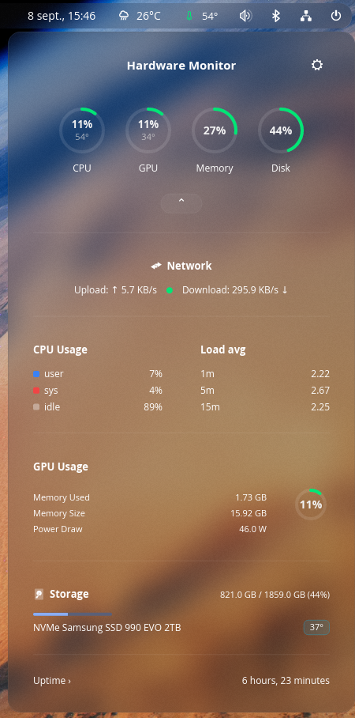

<div align="center">


# COSMIC HARDWARE MONITOR

**La température de votre machine, d'un coup d'œil dans le panneau COSMIC.**

[](LICENSE)
[](https://github.com/Kai-J-G/CosmicHardwareMonitor/tags)
[](https://www.rust-lang.org)
[](https://system76.com/cosmic)

[🇬🇧](README.md) · [🇫🇷](README.fr.md)



</div>

Se place dans votre panneau avec un thermomètre teinté selon l'état thermique,
et s'ouvre sur un moniteur complet pour le processeur, le GPU, la mémoire et le
stockage.

Écrit en Rust avec [libcosmic](https://github.com/pop-os/libcosmic). Lit
directement le noyau — aucun démon, aucun service auxiliaire, aucune dépendance
à `lm_sensors`.

---

## Sommaire

- [Ce qu'il affiche](#ce-quil-affiche)
- [Prérequis](#prérequis)
- [Installation](#installation)
- [Ajout au panneau](#ajout-au-panneau)
- [Mise à jour](#mise-à-jour)
- [Désinstallation](#désinstallation)
- [Compilation manuelle](#compilation-manuelle)
- [Dépannage](#dépannage)
- [Traduire](#traduire)
- [Structure du projet](#structure-du-projet)
- [Licence](#licence)

---

## Ce qu'il affiche

**Dans le panneau** — un thermomètre teinté selon l'état thermique (cyan →
émeraude → or → ambre → rouge) à côté de la température actuelle du processeur.

**Dans la fenêtre** — quatre cadrans pour le processeur, le GPU, la mémoire et
le disque, chacun menant à son propre onglet, au-dessus d'un panneau dépliable
avec le débit réseau, la répartition utilisateur/système/inactif, les charges
moyennes, la VRAM, les températures des disques et le temps de fonctionnement.

| Onglet | Relevés |
| --- | --- |
| **Processeur** | Température du package, utilisation, fréquence moyenne, consommation, nombre de processus/fils/descripteurs, courbe de température, et une grille par cœur avec les fréquences en direct |
| **GPU** | Utilisation, fréquence, consommation, températures bord et jonction, utilisation de la VRAM |
| **Mémoire** | Utilisée et disponible, répartition physique et fichier d'échange, engagée et en cache, avec un historique |
| **Stockage** | Débits de lecture et d'écriture, et chaque partition montée avec son espace libre |
| **Paramètres** | Suivre le thème du bureau ou le fixer clair/sombre, °C ou °F, intervalle d'actualisation de 1 s à 5 s |

**Matériel pris en charge**

| | Source |
| --- | --- |
| Processeur AMD | `k10temp` / `zenpower` — températures Tctl/Tdie et par CCD |
| Processeur Intel | `coretemp` — températures package et par cœur |
| GPU AMD | `sysfs` et le périphérique DRM |
| GPU NVIDIA | `nvidia-smi` |
| GPU Intel | hwmon `i915` / `xe` |
| Stockage | hwmon `nvme` / `drivetemp`, `/proc/diskstats`, `statvfs` |

---

## Prérequis

**Pour l'exécuter**

- Une session **COSMIC** (c'est une applet de panneau, elle n'a pas de fenêtre autonome).
- Linux, avec les systèmes de fichiers `/sys` et `/proc` habituels.
- `libxkbcommon` — déjà présent dans toute session COSMIC.

**Pour la compiler**

| Paquet | Pourquoi |
| --- | --- |
| Une chaîne **Rust** stable récente | Testé avec la 1.98 ; édition 2021 |
| **git** | `libcosmic` est récupéré comme dépendance git |
| **just** | Exécute les recettes d'installation |
| En-têtes **libxkbcommon** | Liés par la couche fenêtrage |
| **pkgconf** / `pkg-config` | Utilisé par les scripts de compilation des dépendances |

Sur Arch et CachyOS, `makepkg -si` lit ces dépendances depuis le `PKGBUILD` et
les installe pour vous ; l'étape 1 ne concerne donc que la voie `just install`.

**Facultatif, améliore l'affichage**

- `pciutils` — fournit un nom de GPU lisible quand le pilote n'en expose pas.
- `nvidia-smi` (fourni avec le pilote NVIDIA) — requis pour la télémétrie NVIDIA.

---

## Installation

### 1. Installer les prérequis

<details open>
<summary><strong>Arch / CachyOS</strong></summary>

```bash
sudo pacman -S --needed rustup just git libxkbcommon pkgconf pciutils
```

Si vous n'avez jamais utilisé `rustup`, choisissez une chaîne d'outils :

```bash
rustup default stable
```

</details>

<details>
<summary><strong>Fedora</strong></summary>

```bash
sudo dnf install cargo just git libxkbcommon-devel pkgconf-pkg-config pciutils
```

</details>

<details>
<summary><strong>Debian / Ubuntu</strong></summary>

```bash
sudo apt install cargo git libxkbcommon-dev pkg-config pciutils
```

`just` n'est pas empaqueté sur les versions plus anciennes. Si `apt install just` échoue :

```bash
cargo install just
```

</details>

### 2. Cloner

```bash
git clone https://github.com/Kai-J-G/CosmicHardwareMonitor.git
```

```bash
cd CosmicHardwareMonitor
```

### 3. Installer

**Sur Arch ou CachyOS**, compilez le paquet — pacman le suit alors, et
`pacman -R` le retire proprement :

```bash
makepkg -si
```

**Sur tout autre système**, installez dans votre dossier personnel. Aucun `sudo`
n'est nécessaire :

```bash
just install
```

> **La première compilation est longue.** Cargo récupère `libcosmic` et tout son
> arbre de dépendances depuis git puis compile l'ensemble — comptez plusieurs
> minutes, et un dossier `target/` de plusieurs Go (environ 9 Go une fois les
> compilations debug et release présentes). Les suivantes prennent quelques
> secondes, et `cargo clean` récupère tout cet espace.

### Ce qui est installé

`makepkg -si` installe à l'échelle du système sous `/usr`, comme tout paquet
pacman. `just install` place tout sous `~/.local`, sans toucher aux dossiers
système :

| Fichier | Chemin |
| --- | --- |
| Exécutable | `~/.local/bin/cosmic-ext-hardware-monitor` |
| Entrée de bureau | `~/.local/share/applications/io.github.kai_j_g.CosmicHardwareMonitor.desktop` |
| Métadonnées AppStream | `~/.local/share/metainfo/io.github.kai_j_g.CosmicHardwareMonitor.metainfo.xml` |
| Icônes | `~/.local/share/icons/hicolor/scalable/apps/io.github.kai_j_g.CosmicHardwareMonitor{,-symbolic}.svg` |

---

## Ajout au panneau

1. Ouvrez **Paramètres COSMIC → Bureau → Panneau → Applets**.
2. Cliquez sur **Ajouter une applet**.
3. Sélectionnez **Cosmic Hardware Monitor** et placez-la où vous voulez.
4. Cliquez sur l'icône du panneau pour ouvrir la fenêtre.

Si elle n'apparaît pas dans la liste, voyez [Dépannage](#dépannage).

---

## Mise à jour

```bash
git pull && just install
```

Sur Arch ou CachyOS, `git pull && makepkg -si` à la place. Notez que le
`PKGBUILD` compile la dernière **version étiquetée**, pas l'état de `main` : un
`git pull` ne change donc rien tant qu'aucune nouvelle version n'est étiquetée.

L'applet lit ses réglages via `cosmic-config` : votre thème, votre unité et
votre intervalle survivent aux réinstallations.

Le panneau continue d'exécuter l'ancien binaire jusqu'à son redémarrage.
Déconnectez-vous puis reconnectez-vous, ou redémarrez seulement le panneau —
`cosmic-session` le surveille et le relance aussitôt :

```bash
pkill cosmic-panel
```

---

## Désinstallation

Retirez d'abord l'applet de votre panneau, dans **Paramètres COSMIC → Bureau →
Panneau → Applets**. Puis, si vous avez installé le paquet :

```bash
sudo pacman -R cosmic-ext-hardware-monitor
```

ou, si vous avez utilisé `just install` :

```bash
just uninstall
```

Vos réglages restent dans
`~/.config/cosmic/io.github.kai_j_g.CosmicHardwareMonitor/`. Supprimez ce
dossier si vous voulez aussi les effacer :

```bash
rm -r ~/.config/cosmic/io.github.kai_j_g.CosmicHardwareMonitor
```

---

## Compilation manuelle

| Commande | Effet |
| --- | --- |
| `just` | Identique à `just build-release` |
| `just build-release` | Compilation optimisée → `target/release/cosmic-ext-hardware-monitor` |
| `just build-debug` | Compilation rapide, non optimisée |
| `just run` | Lance l'applet directement avec `RUST_BACKTRACE=1` |
| `just check` | `cargo check` puis `cargo test` |
| `just install` | Compile, puis installe dans `PREFIX` (`~/.local` par défaut) |
| `just uninstall` | Retire tous les fichiers installés |

Cargo fonctionne aussi directement :

```bash
cargo build --release
```

```bash
cargo test
```

Le profil release active le LTO léger, une seule unité de génération et le
retrait des symboles : `just build-release` est donc nettement plus lent qu'une
compilation debug, mais produit un binaire bien plus petit.

---

## Dépannage

<details>
<summary><strong>L'applet n'apparaît pas dans la liste</strong></summary>

COSMIC recherche les applets au démarrage du panneau : une applet fraîchement
installée n'est donc pas vue avant. Se déconnecter et se reconnecter règle le
problème dans presque tous les cas. Pour éviter la déconnexion, redémarrez
seulement le panneau — `cosmic-session` le relance aussitôt :

```bash
pkill cosmic-panel
```

Si elle manque toujours, vérifiez que l'entrée de bureau est au bon endroit :

```bash
ls ~/.local/share/applications/io.github.kai_j_g.CosmicHardwareMonitor.desktop
```

Un fichier absent signifie que `just install` n'est pas allé au bout.

</details>

<details>
<summary><strong>La température du processeur affiche exactement 40 °C</strong></summary>

C'est la valeur de repli utilisée quand aucun capteur thermique n'est trouvé —
l'applet lit `k10temp`, `zenpower` et `coretemp` sous `/sys/class/hwmon`.
Vérifiez ce que votre noyau expose :

```bash
for d in /sys/class/hwmon/hwmon*; do echo "$(basename $d): $(cat $d/name)"; done
```

Si aucun de ces pilotes n'est listé, chargez celui de votre processeur
(`k10temp` pour AMD, `coretemp` pour Intel) avec `sudo modprobe`.

</details>

<details>
<summary><strong>La consommation affiche « Estimation… »</strong></summary>

La consommation du package provient du compteur d'énergie RAPL du noyau.
Certaines distributions le réservent à root par mesure de sécurité, auquel cas
l'applet ne peut pas le lire :

```bash
ls -l /sys/class/powercap/intel-rapl/intel-rapl:0/energy_uj
```

Si les droits sont `-r--------`, le compteur est réservé à root sur votre
système et ce champ restera indisponible. Cela n'affecte aucun autre relevé.

</details>

<details>
<summary><strong>L'onglet GPU indique qu'aucun GPU n'est détecté</strong></summary>

- **AMD** — nécessite le pilote `amdgpu` chargé et une entrée `amdgpu` dans `/sys/class/hwmon`.
- **NVIDIA** — nécessite `nvidia-smi` dans le `PATH` ; il est fourni avec le pilote propriétaire. Nouveau n'expose aucune télémétrie.
- **Intel** — nécessite le hwmon `i915` ou `xe` ; les graphiques intégrés ne remontent qu'une température.

Le fabricant est détecté une seule fois au démarrage : redémarrez l'applet après
avoir installé un pilote.

</details>

<details>
<summary><strong>Mon GPU porte un nom peu parlant</strong></summary>

Le nom vient du périphérique DRM, avec `lspci` en repli. Installez `pciutils`
si `lspci` est absent.

</details>

<details>
<summary><strong>Pas de température pour un disque SATA</strong></summary>

Les disques NVMe sont gérés d'office par le pilote `nvme`. Les disques SATA
nécessitent le module `drivetemp` :

```bash
sudo modprobe drivetemp
```

Ajoutez `drivetemp` à `/etc/modules-load.d/` pour qu'il persiste au redémarrage.

</details>

---

## Traduire

Toutes les chaînes visibles sont dans
`i18n/en/cosmic_ext_hardware_monitor.ftl`. Pour ajouter une langue, copiez ce
fichier dans `i18n/<code>/` et traduisez les valeurs :

```bash
mkdir -p i18n/de && cp i18n/en/*.ftl i18n/de/
```

Laissez les identifiants à gauche des `=` tels quels, et conservez les
`{ $variables }` — elles sont remplies à l'exécution. Rien d'autre ne change :
les fichiers sont intégrés au binaire à la compilation, et l'applet choisit la
langue selon les réglages de votre bureau, avec l'anglais en repli pour ce qui
n'est pas traduit.

`cargo test` vérifie que chaque langue définit le même ensemble d'identifiants :
une traduction incomplète fait échouer la compilation plutôt que d'afficher de
l'anglais au milieu d'une phrase.

---

## Structure du projet

```
src/
  main.rs            point d'entrée, et un aperçu de l'articulation
  app.rs             état de l'applet, messages et boucle de mise à jour
  config.rs          réglages persistants (cosmic-config)
  i18n.rs            localisation, et la macro fl!() utilisée par les vues
  hardware/          lit la machine
    sysfs.rs         aides sysfs/procfs, énumération hwmon, mesure de débit
    cpu/mod.rs       modèle, températures, fréquences, consommation
    cpu/usage.rs     utilisation, à partir des compteurs /proc/stat
    gpu.rs           télémétrie AMD / NVIDIA / Intel
    storage.rs       températures des disques, débits, partitions
    system.rs        temps de fonctionnement, charge, réseau, mémoire
    types.rs         les données que les vues affichent
    sandbox.rs       détecte un bac à sable Flatpak, où deux relevés sont masqués
  views/             affiche la fenêtre
    mod.rs           structure de la fenêtre et widgets communs
    panel.rs         bouton du panneau et surface de la fenêtre
    style.rs         styles de conteneurs partagés
    fmt.rs           mise en forme des valeurs
i18n/                traductions, un fichier Fluent par langue
data/                entrée de bureau, métadonnées AppStream, icônes, captures
```

`cargo doc --open` affiche tout cela avec la documentation des modules, c'est le
chemin d'entrée le plus rapide.

---

## Crédits

Inspiré par [TempTyle](https://github.com/neojakey/TempTyle) de neojakey.

## Licence

[MIT](LICENSE)
