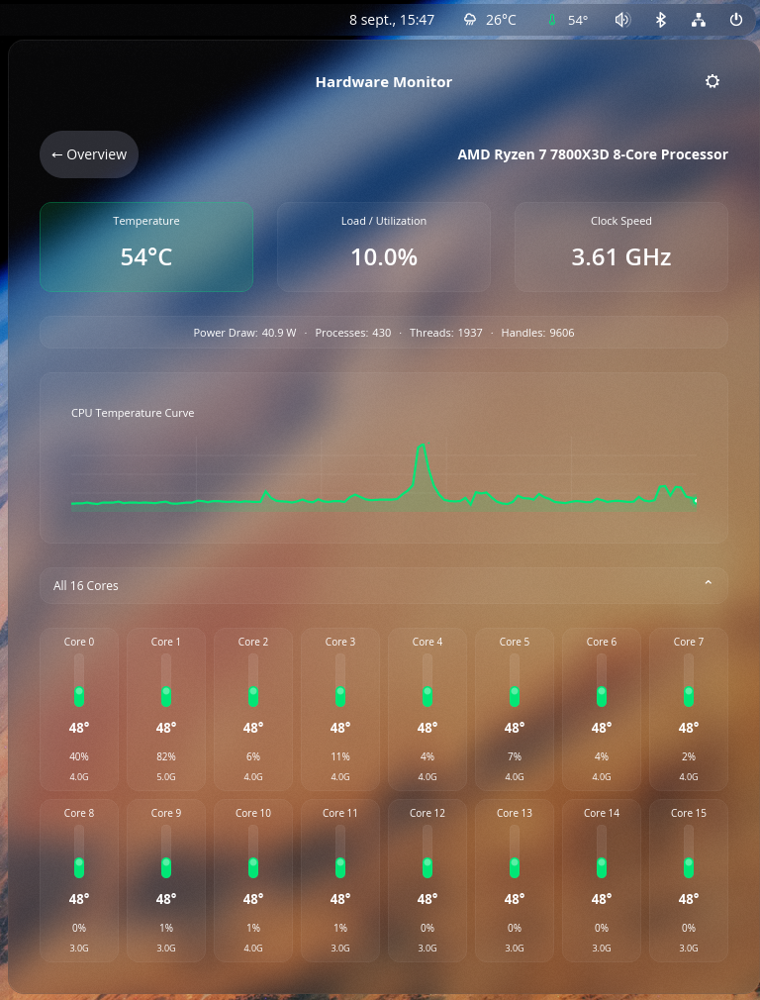

<div align="center">


# Hardware Monitor for COSMIC™

**Your machine's temperature, at a glance in the panel.**

[](LICENSE)
[](https://github.com/Kai-J-G/cosmic-ext-hardware-monitor/tags)
[](https://www.rust-lang.org)
[](https://system76.com/cosmic)

[🇬🇧](README.md) · [🇫🇷](README.fr.md)


</div>

---

## Install

You need a **COSMIC™ desktop** session. Everything else is handled below.

<details open>
<summary><strong>Arch · CachyOS · EndeavourOS</strong></summary>

```bash
sudo pacman -S --needed rustup just git base-devel
```

```bash
git clone https://github.com/Kai-J-G/cosmic-ext-hardware-monitor.git
cd cosmic-ext-hardware-monitor
makepkg -si
```

This builds a normal package, so `pacman` keeps track of it.

</details>

<details>
<summary><strong>Fedora</strong></summary>

```bash
sudo dnf install cargo just git libxkbcommon-devel pkgconf-pkg-config pciutils
```

```bash
git clone https://github.com/Kai-J-G/cosmic-ext-hardware-monitor.git
cd cosmic-ext-hardware-monitor
just install
```

</details>

<details>
<summary><strong>Debian · Ubuntu</strong></summary>

```bash
sudo apt install cargo just git libxkbcommon-dev pkg-config pciutils
```

If `just` isn't available, use `cargo install just` instead.

```bash
git clone https://github.com/Kai-J-G/cosmic-ext-hardware-monitor.git
cd cosmic-ext-hardware-monitor
just install
```

</details>

> **The first build takes a few minutes.** It downloads and compiles the COSMIC
> toolkit. Later builds take seconds. `just install` puts everything in your
> home folder and never asks for `sudo`.

### Add it to your panel

1. Open **Settings → Desktop → Panel → Applets**
2. Click **Add Applet**
3. Pick **Hardware Monitor for COSMIC™**

Nothing showing up? Log out and back in — the panel only looks for new applets
when it starts.

---

## What you get

A thermometer in your panel that changes colour as things heat up, and a click
away, the whole picture.

<div align="center">

</div>

- **CPU** — temperature, load, clock speed, power draw, and every core with its
  own bar and live frequency
- **GPU** — load, clock, power, edge and hotspot temperatures, VRAM
- **Memory** — in use, available, swap, with a history graph
- **Storage** — read and write speeds, and free space per partition
- **At a glance** — network speed, load averages, drive temperatures, uptime

Colours follow your desktop accent. Temperatures use their own scale, so a hot
CPU always looks hot.

### Settings

Click the gear in the popup. You can follow your desktop theme or pin light or
dark, switch between °C and °F, and choose how often it refreshes (1–5 seconds).

---

## Updating and removing

**Update** — pull and reinstall the same way you installed:

```bash
git pull && makepkg -si    # Arch
git pull && just install   # everything else
```

Your settings are kept. Restart the panel afterwards with `pkill cosmic-panel`,
which comes straight back.

**Remove** — take it out of your panel first, in **Settings → Desktop → Panel →
Applets**, then:

```bash
sudo pacman -R cosmic-ext-hardware-monitor   # Arch
just uninstall                               # everything else
```

---

## Something not working?

<details>
<summary><strong>The CPU temperature reads exactly 40°C</strong></summary>

That's the placeholder shown when no CPU sensor can be found. See what your
system exposes:

```bash
for d in /sys/class/hwmon/hwmon*; do echo "$(basename $d): $(cat $d/name)"; done
```

If you don't see `k10temp` (AMD) or `coretemp` (Intel), load it with
`sudo modprobe k10temp` or `sudo modprobe coretemp`.

</details>

<details>
<summary><strong>Power draw says "Estimating…"</strong></summary>

Some distributions restrict the kernel's power counter to root, so the applet
can't read it. Everything else still works. To check:

```bash
ls -l /sys/class/powercap/intel-rapl/intel-rapl:0/energy_uj
```

Mode `-r--------` means it's root-only on your system.

</details>

<details>
<summary><strong>No GPU detected</strong></summary>

- **AMD** — needs the `amdgpu` driver loaded
- **NVIDIA** — needs `nvidia-smi`, which ships with the proprietary driver.
  Nouveau doesn't report anything.
- **Intel** — integrated graphics only report a temperature

The GPU is detected once at start-up, so restart the applet after installing a
driver.

</details>

<details>
<summary><strong>No temperature for a SATA drive</strong></summary>

NVMe drives work out of the box. SATA drives need one module:

```bash
sudo modprobe drivetemp
```

Add `drivetemp` to `/etc/modules-load.d/` to keep it after a reboot.

</details>

<details>
<summary><strong>My GPU has an odd name</strong></summary>

The name comes from the driver, falling back to `lspci`. Install `pciutils` if
it's missing. Some cards share one identifier across several models, so the name
may list all of them.

</details>

---

## For developers

<details>
<summary><strong>Building and hacking</strong></summary>

| Command | What it does |
| --- | --- |
| `just build-release` | Optimised build |
| `just build-debug` | Fast, unoptimised build |
| `just run` | Run it directly |
| `just check` | `cargo check` and `cargo test` |
| `just install` / `just uninstall` | Install to `~/.local`, or remove |

Readings come straight from `/sys` and `/proc` — no daemon, no helper service,
no `lm_sensors`. `/sys/class/hwmon` is scanned once per refresh and shared
between the CPU, GPU and storage collectors, and anything fixed (CPU model, GPU
vendor) is resolved once at start-up.

```
src/
  main.rs       entry point, and an overview of how the pieces fit
  app.rs        state, messages, update loop
  config.rs     persisted settings
  i18n.rs       localization, and the fl!() macro
  hardware/     reads the machine
  views/        draws the popup
i18n/           translations, one Fluent file per language
data/           desktop entry, metainfo, icons, screenshots
```

`cargo doc --open` is the quickest way in.

</details>

<details>
<summary><strong>Translating</strong></summary>

Every string lives in `i18n/en/cosmic_ext_hardware_monitor.ftl`. To add a
language, copy that folder and translate the values:

```bash
mkdir -p i18n/de && cp i18n/en/*.ftl i18n/de/
```

Keep the ids on the left of each `=` and the `{ $placeholders }` as they are.
The applet picks the language from your desktop settings. `cargo test` checks
that no translation is missing an entry.

French is included as an example.

</details>

<details>
<summary><strong>Flatpak</strong></summary>

```bash
flatpak-builder --user --install --force-clean build io.github.kai_j_g.HardwareMonitor.json
```

Two readings can't work inside the sandbox and are hidden rather than shown
wrong: the process count, and per-partition usage. NVIDIA isn't supported in the
Flatpak build, since `nvidia-smi` isn't in the runtime.

</details>

---

## Credits

Inspired by [TempTyle](https://github.com/neojakey/TempTyle) by neojakey.

## AI assistance

Parts of this project were written with assistance from
[Claude](https://claude.ai) (Anthropic): a refactor of the source, the
localization system, the Flatpak sandbox handling, the packaging metadata, and
most of this documentation. The applet's original implementation and its design
direction are mine, and AI-assisted commits carry a `Co-Authored-By` trailer.

## Trademark

COSMIC™ is a trademark of [System76, Inc.](https://system76.com) This is an
unofficial, third-party applet **for the COSMIC™ desktop**, not affiliated with
or endorsed by System76. It follows the
[COSMIC trademark policy](https://github.com/pop-os/cosmic-epoch/blob/master/TRADEMARK.md):
the encouraged `cosmic-ext-` namespace, and its own App ID namespace rather than
the reserved `cosmic-` or `com.system76.` prefixes.

## License

[MIT](LICENSE)
